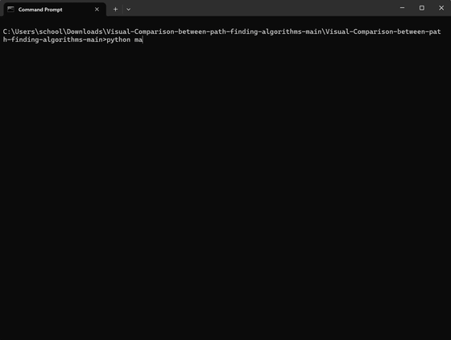

# Visual Comparison of Pathfinding Algorithms



Run **six** maze solvers on the *same* maze at once and watch them race in a 3x2 grid: single-source BFS, DFS, and A*, plus their **bidirectional (dual)** versions that search from the start and goal simultaneously.

Built with **Python + Pygame**.

---

## Why

Reading pseudocode does not show how differently these algorithms explore. Running them side-by-side on one maze makes the trade-offs obvious:

- **BFS** — expands level by level, guarantees the shortest path, explores a lot
- **DFS** — dives deep first, moves fast but is rarely optimal
- **A*** — Manhattan heuristic pulls the search toward the goal, expanding far fewer cells
- **Dual (bidirectional)** — two frontiers grow from start and goal and meet in the middle, usually visiting fewer cells than the single-source version

---

## Layout

```
main.py                        # Generate maze, run all 6 algorithms, launch visualizer
maze_generator.py              # Recursive-backtracker maze + loops
visualizer.py                  # 3x2 side-by-side Pygame animation
BFS_Breath_First_Search.py     # Single-source BFS
DFS_Depth_First_Search.py      # Single-source DFS
Astar.py                       # Single-source A*
Dual_BFs.py                    # Bidirectional BFS
Dual_DFS.py                    # Bidirectional DFS
Dual_Astar.py                  # Bidirectional A*
requirements.txt
demos/
  pathfinding-comparison-demo.gif   # Full demo (README preview)
  real-recording.mp4                # Original screen recording
```

---

## Run

```bash
python -m venv .venv

# Windows
.venv\Scripts\activate

# macOS / Linux
# source .venv/bin/activate

pip install -r requirements.txt
python main.py
```

Enter a maze size when prompted (e.g. `31`). A window opens with all six searches animating together, then each panel holds its final green path.

---

## Author

[Aniket Thakur](https://github.com/AniketT0008) · [Portfolio](https://aniketthakur.vercel.app)
